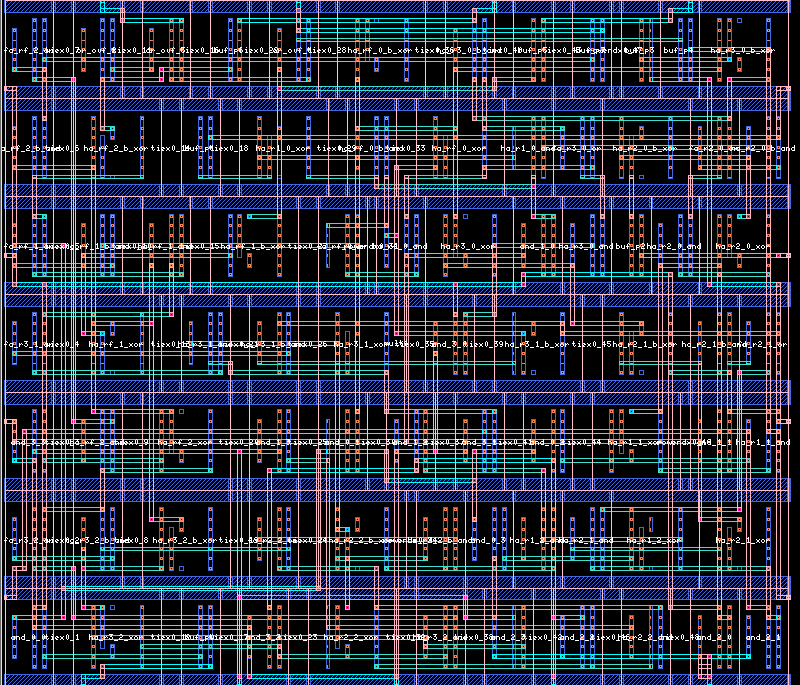

# mult4 — 4×4 unsigned multiplier (Alliance CAD)

A structural 4×4 unsigned array multiplier with overflow detection, described
procedurally for [Alliance CAD](http://alliance-vlsi.org/)'s `genlib`,
verified exhaustively (all 256 input combinations) with `asimut`, placed and
routed into a real layout (`ocp` + `nero`, viewed in `graal`), and
cross-checked at the transistor level with `spiceopus`.

```
P[7:0] = A[3:0] * B[3:0]
OVF    = 1 if P > 15
```

16 `a2_x2` (AND2) cells build the partial-product matrix; half and full
adders (`xr2_x1`, `o2_x2`) sum its diagonals into `P[7:0]`; `OVF` is the OR
of the four high bits.

## Result

256 / 256 test vectors match — every product and overflow bit verified
against `mult4_table.txt`, a plain reference truth table.

## Physical layout



Real place & route output (`ocp` for placement, `nero` for routing), viewed
in `graal`: 127 cells (37 AND2, 21 XOR2, 12 OR2, 8 buffers, plus filler/tie
cells), across 7 standard-cell rows.

## Propagation delay

Found empirically, not assumed: `find_delay.sh` runs the full 256-case suite
through `asimut` at decreasing settle times (gap between forcing inputs and
checking outputs) until it starts failing.

```
settle=15ns  errors=0
settle=13ns  errors=0   <- last settle time with zero errors
settle=12ns  errors=1   <- first failure
settle=11ns  errors=8
settle=10ns  errors=25
```

**13 ns**, using the real per-cell delay declared in every sxlib behavioural
model (`after 1000 ps` — see `a2_x2.vbe`, `xr2_x1.vbe`, `o2_x2.vbe`,
`buf_x2.vbe`), for the worst-case transition (`0×0 → 15×15`, the deepest
carry-chain path through `OVF`). `mult4_test.pat` uses a 15 ns settle time
(a small margin over the measured minimum).

As a transistor-level cross-check, `mult4_e.spi` — extracted for real from
the routed layout with `cougar -t -ac` (578 transistors, real parasitic
capacitances) — was simulated in `spiceopus` (`tb_delay.cir`) with a
*generic, illustrative* Level=1 MOSFET model (not calibrated to any real
fab — Alliance's bundled "cmos" technology only ships design-rule/geometry
data, no electrical device models). Under that model the same transition
settles in **~1.8 ns**. The two numbers aren't expected to match: one is a
flat logic-level placeholder delay, the other depends on the borrowed
model's assumed transistor sizing — they're different abstraction levels,
not a contradiction.

## Running it

Requires Docker.

```
./start.sh       # boots Docker, builds the alliance-cad image on first run
./run.sh         # compiles mult4.c with genlib, simulates all 256 vectors, prints the result
./place_route.sh # places + routes mult4.vst into mult4.ap (ocp + nero)
./find_delay.sh  # sweeps settle time through asimut to find the propagation delay
./stop.sh        # shuts Docker down
```

To view the layout yourself: enter the container (`./start.sh`) and run
`graal -l mult4` (needs an X display, or Xvfb for a headless capture).

To reproduce the SPICE cross-check: `cougar -v -t -ac mult4 mult4_e` inside
the container (see `tb_delay.cir` for the exact env vars and the leakage-
resistor fix for two extraction-artifact floating nodes), then `spiceopus`
→ `source tb_delay.cir` at its interactive prompt (this SpiceOpus build has
no headless/batch mode, so it can't be scripted into `run.sh`).

## Layout

| File | Purpose |
|---|---|
| `mult4.c` | genlib structural description of the multiplier |
| `mult4_table.txt` | reference truth table (A, B, P, OVF), one line per case — the single source of truth |
| `mult4_test.pat` | exhaustive test bench, generated from the table, 15ns settle |
| `tb_delay.cir` | SPICE testbench around the extracted netlist, for the delay cross-check |
| `build_mult4.sh` | `genlib` + netlist fix-up |
| `place_route.sh` | `ocp` (placement) + `nero` (routing) → `mult4.ap` |
| `find_delay.sh` / `gen_pat.py` | propagation-delay sweep (see above), reads `mult4_table.txt` |
| `run.sh` / `start.sh` / `stop.sh` | Docker lifecycle + one-shot build & simulate, checks against `mult4_table.txt` |
| `Dockerfile` | Ubuntu 18.04 + Alliance CAD 5.1.1 (i386 build, see below) |

## Toolchain notes

Issues in the packaged Alliance CAD tools that had to be worked around:

- **`asimut` (amd64) segfaults on any structural netlist that instantiates a
  component** — reproduced independently of this design with a minimal
  hand-written netlist. The fix is running the i386 build instead
  (`alliance:i386`), which works correctly on a 64-bit host. Because the two
  package variants conflict on file paths, `genlib`'s own C compilation step
  also has to target 32-bit (`gcc-multilib` + `-m32`) to link against the
  now-32-bit Alliance libraries.
- **`genlib`'s direct-to-VST writer mangles bus port names**: `a(0)` becomes
  the illegal VHDL identifier `a_0_` (trailing underscore). `build_mult4.sh`
  strips it after generation.
- **`ocp`/`nero`/`dreal`/`graal` need a technology file that isn't where they
  look by default** (`$ALLIANCE_TOP/etc/cmos.rds`, i.e. `/usr/etc/cmos.rds`)
  — the package actually installs it at `/etc/cmos.rds` (and
  `/etc/cmos.graal`, `/etc/cmos.dreal`, `/etc/spimodel.cfg`). Point
  `RDS_TECHNO_NAME` / `GRAAL_TECHNO_NAME` / `DREAL_TECHNO_NAME` /
  `MBK_SPI_MODEL` at the real path.
- **`cougar`'s SPICE extraction leaves two internal nodes floating** (no DC
  path to ground), which SpiceOpus's floating-node check aborts on. Fixed
  with two 1e12 ohm resistors to vss inside the extracted `.subckt` — see
  the comment in `tb_delay.cir`.
- **SpiceOpus 3.0.407's Debian package needs glibc ≥ 2.35**, incompatible
  with the Ubuntu 18.04 Alliance image (glibc 2.27) — it runs in a separate
  `ubuntu:24.04` container instead, working from the same extracted netlist.

All of the above (except the SPICE cross-check, which needs SpiceOpus's
interactive console) are baked into the `Dockerfile` and the `.sh` scripts,
so none of it needs to be repeated by hand.
