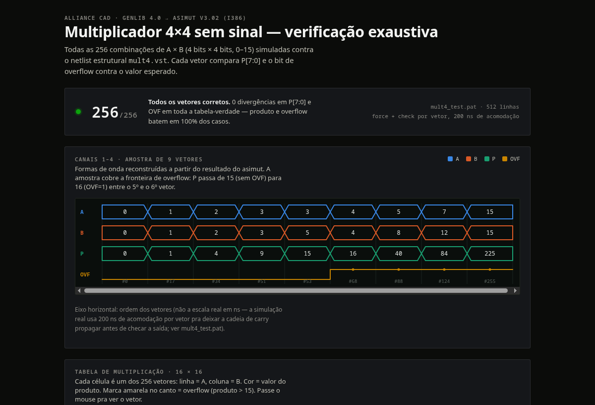
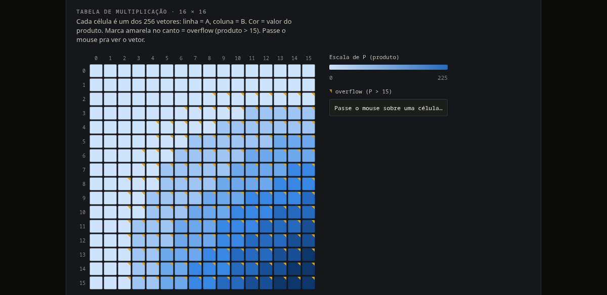

# mult4 — 4×4 unsigned multiplier (Alliance CAD)

A structural 4×4 unsigned array multiplier with overflow detection, described
procedurally for [Alliance CAD](http://alliance-vlsi.org/)'s `genlib` and
verified exhaustively (all 256 input combinations) with `asimut`.

```
P[7:0] = A[3:0] * B[3:0]
OVF    = 1 if P > 15
```

16 `a2_x2` (AND2) cells build the partial-product matrix; half and full
adders (`xr2_x1`, `o2_x2`) sum its diagonals into `P[7:0]`; `OVF` is the OR
of the four high bits.

## Result

256 / 256 test vectors match — every product and overflow bit verified
against the expected value.





Interactive version (hover any cell, filter the full 256-row log):
**[live artifact →](https://claude.ai/code/artifact/a2236351-1edb-414e-91ad-00a567711e15)**

## Running it

Requires Docker.

```
./start.sh   # boots Docker, builds the alliance-cad image on first run
./run.sh     # compiles mult4.c with genlib, simulates all 256 vectors, prints the result
./stop.sh    # shuts Docker down
```

`run.sh` does everything in one shot: `genlib` compilation, the netlist
fix-up, the `asimut` run, and a pass/fail summary. No need to enter the
container manually.

## Layout

| File | Purpose |
|---|---|
| `mult4.c` | genlib structural description of the multiplier |
| `mult4_test.pat` | exhaustive test bench, 256 cases × force/check pair |
| `build_mult4.sh` | `genlib` + netlist fix-up (run inside the container) |
| `run.sh` / `start.sh` / `stop.sh` | Docker lifecycle + one-shot build & simulate |
| `Dockerfile` | Ubuntu 18.04 + Alliance CAD 5.1.1 (i386 build, see below) |
| `gen_test_vectors.py` | reference table generator for the test bench |

## Toolchain notes

Two issues in the packaged Alliance CAD tools had to be worked around:

- **`asimut` (amd64) segfaults on any structural netlist that instantiates a
  component** — reproduced independently of this design with a minimal
  hand-written netlist. The fix is running the i386 build instead
  (`alliance:i386`), which works correctly on a 64-bit host. Because the two
  package variants conflict on file paths, `genlib`'s own C compilation step
  also has to target 32-bit (`gcc-multilib` + `-m32`) to link against the
  now-32-bit Alliance libraries.
- **`genlib`'s direct-to-VST writer mangles bus port names**: `a(0)` becomes
  the illegal VHDL identifier `a_0_` (trailing underscore). `build_mult4.sh`
  strips it after generation.

Both are baked into the `Dockerfile` and `build_mult4.sh`, so none of this
needs to be repeated.
